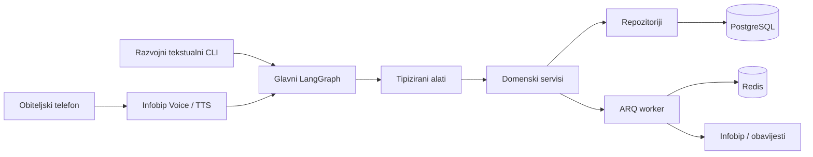
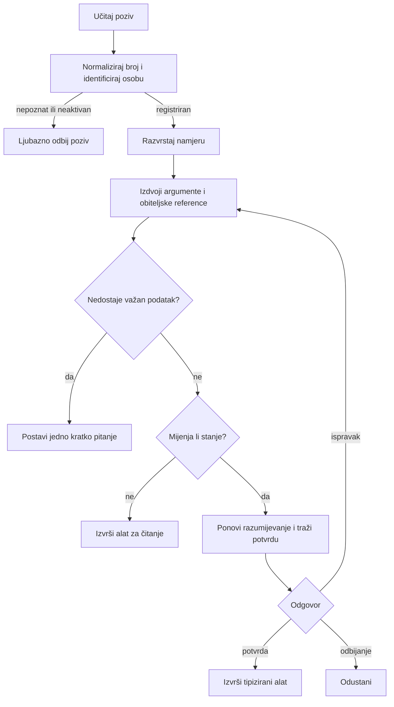
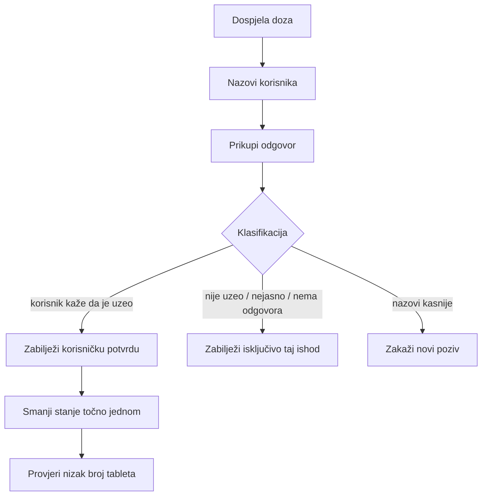
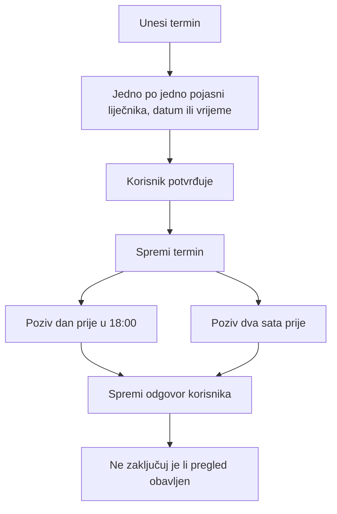
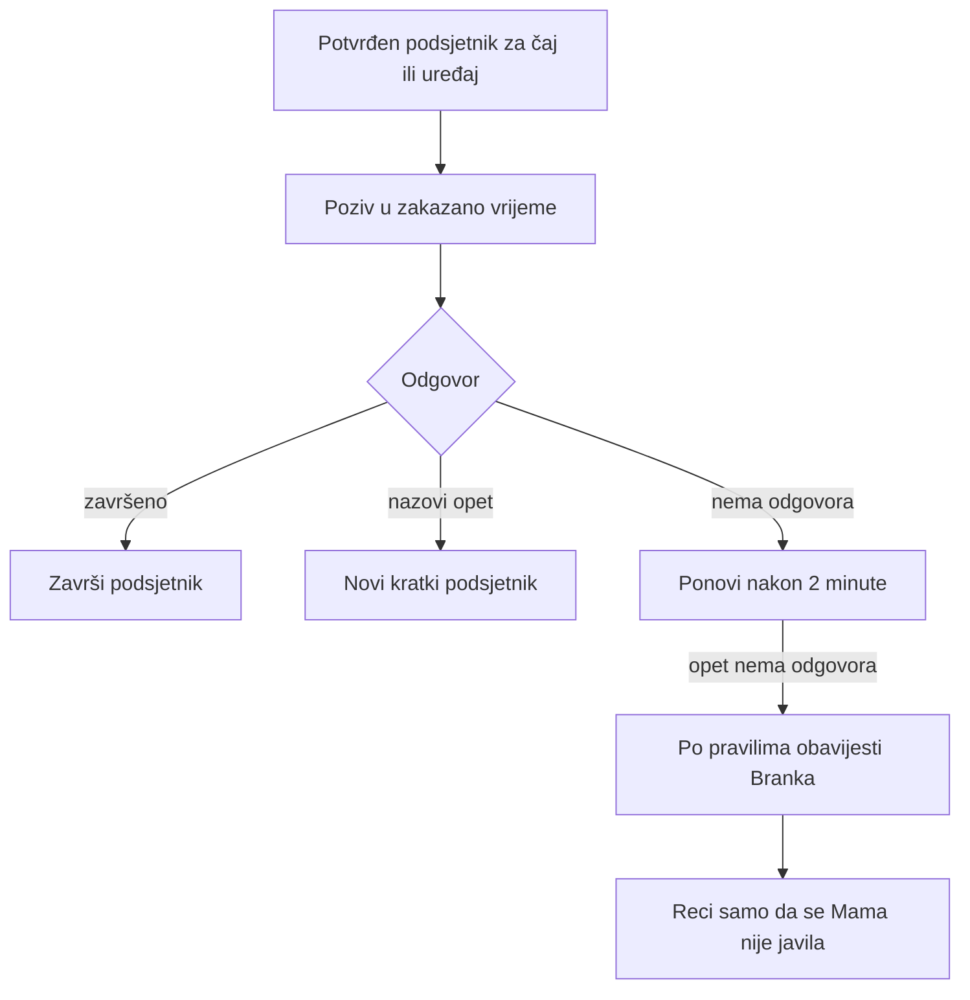

# Zvonko

Zvonko je privatni telefonski pomoćnik za jednu hrvatsku obitelj. Mama, Tata, Branko i
Nataša nazovu jedan broj, razgovaraju prirodno na hrvatskom i potvrde ono što je Zvonko
razumio. Nema aplikacije, PIN-a, telefonskog izbornika ni posebnih naredbi.

Prvi MVP usredotočen je na tri stvari: podsjetnike za tablete i njihovo stanje, liječničke
termine te kratke sigurnosne podsjetnike za čaj, lonac, pećnicu i slične kućanske situacije.
Projekt je modularni monolit: svi transporti koriste ista domenska pravila i isti LangGraph.

> Ako Mama ne može koristiti funkciju bez objašnjenja, funkcija nije dovršena.

## Važna ograničenja

- Zvonko bilježi samo ono što je korisnik rekao. Ne provjerava je li lijek fizički uzet.
- Zvonko ne daje medicinske savjete, ne određuje dozu i ne savjetuje duplu ili preskočenu dozu.
- Zvonko ne može otkriti je li štednjak, pećnica ili drugi uređaj stvarno uključen ili isključen.
- Zvonko ne jamči sprječavanje požara ili drugih kućanskih nezgoda.
- Dolazak na liječnički pregled nikada se ne zaključuje samo zato što je termin prošao.
- Caller ID allowlista je praktična obiteljska kontrola pristupa, ne identifikacija visoke sigurnosti.

## Arhitektura



Granice su namjerne:

- FastAPI rute provjeravaju transport i pozivaju aplikacijski sloj.
- LangGraph upravlja razgovorom, ali ne piše izravno u bazu.
- Tipizirani alati provjeravaju argumente i pozivaju servise.
- Servisi provode potvrdu, autorizaciju, idempotenciju i domenska pravila.
- Repozitoriji skrivaju SQLAlchemy i razvojnu JSON pohranu.
- Provider adapteri nikada ne glume uspješan produkcijski poziv.

### Glavni razgovor



### Podsjetnik za lijek



Stanje se ne smanjuje pri zvonjenju, bez odgovora, pri nejasnom odgovoru ili kada korisnik
kaže da nije uzeo tabletu. Svaka promjena stanja zaseban je auditabilan događaj, a ključ
idempotencije sprječava dvostruko oduzimanje iste doze.

### Liječnički termin



### Kućna sigurnost



Sustav ne tvrdi da je nastao požar. Zadani razvojni raspored je drugi poziv nakon dvije
minute, opcionalni treći nakon dodatne tri minute i nenametljiva eskalacija nakon ponovljenih
poziva bez odgovora. Sve je podesivo po članu obitelji.

## Struktura repozitorija

```text
app/
  api/              FastAPI health, interni i Infobip test rub
  agent/            inbound, lijek, termin i safety LangGraph; stanja i alati
  domain/           enum-i, vrijeme, ponavljanje, dozvole i pravila lijekova
  models/           SQLAlchemy 2.x modeli
  repositories/     protokoli, razvojna JSON pohrana i SQLAlchemy adapteri
  services/         podsjetnici, lijekovi, inventar, termini, pozivi, audit
  scheduler/        ARQ poslovi, Redis lock i recovery nakon prekida
  telephony/        Infobip klijent, call_mom i media stream sesija
  providers/        zamjenjivi LLM, STT, TTS i telephony adapteri
  voice/            Pipecat granica, wording i turn policy
  db/migrations/    Alembic migracije
evals/              80+ hrvatskih determinističkih slučajeva i runner
tests/              unit, graph i integration testovi bez plaćenih API-ja
scripts/            seed i Infobip pomoćne naredbe
```

## Lokalni razvoj bez Dockera

Preduvjet je Python 3.11 ili noviji.

```bash
python -m venv .venv
# Windows
.venv\Scripts\activate
python -m pip install -e ".[dev]"
copy .env.example .env
python -m app.dev_cli --caller mama
```

Drugi pozivatelji:

```bash
python -m app.dev_cli --caller tata
python -m app.dev_cli --caller branko
python -m app.dev_cli --caller nataša
python -m app.dev_cli --caller unknown
```

CLI koristi isti `build_inbound_graph` kao telefonski transport. Dodatne mogućnosti:

```bash
python -m app.dev_cli --show-state
python -m app.dev_cli --simulate-due
python -m app.dev_cli --reset
```

Razvojna pohrana je `zvonko-dev.json`; produkcija koristi PostgreSQL. CLI ne kontaktira
Infobip, Deepgram, TTS ni LLM koji se plaća.

## Docker Compose

```bash
copy .env.example .env
docker compose up --build -d postgres redis
docker compose run --rm api alembic upgrade head
docker compose run --rm api python -m scripts.seed_family
docker compose up --build api worker
```

API je na `http://localhost:8000`, health na `/health`, a OpenAPI na `/docs`.

## Okolišne varijable

Najvažnije su:

- `DATABASE_URL`, `REDIS_URL`, `DEFAULT_TIMEZONE`
- `MAMA_PHONE_E164`, `TATA_PHONE_E164`, `BRANKO_PHONE_E164`, `NATASA_PHONE_E164`
- `LLM_PROVIDER`, `LLM_MODEL`, `STT_PROVIDER`, `TTS_PROVIDER`, `TELEPHONY_PROVIDER`
- `INFOBIP_BASE_URL`, `INFOBIP_API_KEY`, `INFOBIP_FROM_NUMBER`, `INFOBIP_TTS_LANGUAGE`, `TELEPHONY_PROVIDER`
- `DEEPGRAM_API_KEY`
- `SAFETY_RETRY_DELAYS_MINUTES`, `SAFETY_ESCALATE_AFTER_NO_ANSWERS`
- `ASSISTANT_GRAMMATICAL_GENDER`, `DEFAULT_LOW_STOCK_THRESHOLD`

Stvarne brojeve i tajne upisati samo u lokalni `.env`; `.env` je izuzet iz Gita. Razvojni
fallback brojevi sintetički su i nisu osobni brojevi.

## Baza, migracije i seed

```bash
alembic upgrade head
alembic current
python -m scripts.seed_family
```

PostgreSQL sprema aware UTC vremena. Govorni sloj ih pretvara u `Europe/Zagreb`, uključujući
ljetno i zimsko računanje vremena. PostgreSQL je izvor istine; Redis služi samo za red,
kratke lockove, koordinaciju retryja i privremeno izvršno stanje.

## API i worker

```bash
uvicorn app.main:app --reload
arq app.scheduler.worker.WorkerSettings
```

ARQ poslovi imaju stabilne ključeve, ograničen broj pokušaja i Redis lock. Recovery traži
dospjele PostgreSQL retke nakon restarta i ponovno ih stavlja u red bez stvaranja duplikata.
Status provider pogreške razlikuje se od statusa `no_answer`.

## Infobip outbound voice

Pomoćna naredba ispisuje checklist za Infobip:

```bash
python -m scripts.setup_infobip
```

Odlazni podsjetnici idu preko Infobip Voice Message API (`POST /tts/3/single`) s hrvatskim TTS-om
ili opcionalnim `audioFileUrl`. Test endpoint:

```bash
curl -X POST http://localhost:8000/internal/test-voice-call \
  -H "Authorization: Bearer $APP_SECRET_KEY" \
  -H "Content-Type: application/json" \
  -d '{"to_number":"+385...", "message":"Bok, ovdje Zvonko."}'
```

Za produkciju postavi `TELEPHONY_PROVIDER=infobip` i Infobip vjerodajnice u `.env`.

## LLM i provider arhitektura

`LanguageUnderstandingProvider`, `StreamingSpeechToText`, `TextToSpeechProvider` i
`TelephonyProvider` su interne granice. Deterministički hrvatski provider radi bez mreže.
Vanjski LLM smije razvrstati namjeru, izdvojiti argumente i sastaviti kratko pitanje, ali ne
smije pisati u bazu, mijenjati stanje tableta, zakazivati pozive ni autorizirati osobu.

## Testovi, kvaliteta i evalovi

```bash
ruff check .
ruff format --check .
mypy app evals
pytest
python -m evals.runner
```

Eval runner ispisuje broj slučajeva, prolaze i padove, postotak, očekivanu/stvarnu namjeru,
alat, argumente, latenciju i čitljiv detalj pogreške. Deterministički suite ne koristi plaćeni API.

## Privatnost i zadržavanje podataka

Zadano se ne čuva sirovi audio ni cjelovita snimka poziva. Čuvaju se samo strukturirani
podsjetnici, korisničke izjave o lijekovima, termini, audit događaji i opcionalni kratki
sanitizirani sažetak. Telefonski brojevi i tajne redigiraju se iz normalnih logova. Audit ne
sprema cijele vendor payloadove ni autorizacijska zaglavlja.

MVP pretpostavlja čuvanje aktivnih podataka dok ih obitelj ne izbriše i minimalnih audit podataka
90 dana; prije produkcije tu politiku treba potvrditi s obitelji i primjenjivim pravilima.
Autorizirani interni DELETE endpoint podržava brisanje razvojnih podataka. Za produkciju treba
dodati transakcijski PostgreSQL postupak brisanja i backup retention politiku.

Nepoznati i neaktivni pozivatelji ne dobivaju imena, brojeve, podsjetnike, lijekove, termine ni
obiteljski status. Registrirani članovi smiju postavljati obiteljska pitanja, a svaka promjena za
drugu osobu ulazi u audit.

## Trenutačni MVP

Implementirano je:

- četiri seedana člana, E.164 normalizacija, aktivna allowlista i odbijanje nepoznatih poziva
- potvrda prije stvaranja ili promjene stanja, korekcija i jedno pojašnjenje odjednom
- opći, ponavljajući i `household_safety` podsjetnici
- planovi lijekova, user-reported ishodi, točno-jednom oduzimanje, dodavanje kutije, korekcija,
  reversal i prag niskog stanja
- liječnički termini, promjena, otkazivanje, upiti i zadani offseti 1440/120 minuta
- glavni i tri izlazna LangGrapha, tipizirani alati, CLI i razvojna JSON postojanost
- SQLAlchemy modeli, Alembic, PostgreSQL/Redis Compose, ARQ poslovi i overdue recovery
- FastAPI health, Infobip outbound voice i interni test endpointi
- 80+ hrvatskih eval slučajeva te testovi bez live vjerodajnica

## Konkretni koraci za stvarne telefonske pozive

1. Nabaviti Infobip broj i unijeti API key, sender broj i `TELEPHONY_PROVIDER=infobip` u `.env`.
2. Odraditi testni poziv preko `/internal/test-voice-call`.
3. Dodati Deepgram API ključ i dovršiti streaming STT adapter za dolazne pozive (`hr-HR`).
4. Spojiti produkcijski SQLAlchemy unit-of-work u graph/tool composition umjesto dev storea.
5. Postaviti monitoring, backup/retention i odraditi testne pozive sa stvarnim brojevima obitelji.

## Roadmap

- live streaming barge-in i bolja detekcija kraja govora
- robustniji hrvatski datumi, dijalekti i anafore uz provider fallback
- transakcijski PostgreSQL unit of work za sve alate
- administrativni CLI za isključivanje broja i GDPR-style izvoz/brisanje
- metrike kvalitete poziva, no-answer razlozi i nenametljive obiteljske eskalacije

Web dashboard, voice cloning i medicinski savjeti nisu dio planiranog prvog MVP-a.

## Rješavanje problema

- **CLI kaže da broj nije registriran:** provjeri E.164 varijable i ponovno pokreni seed.
- **Vrijeme nije prihvaćeno:** reci točan sat; izrazi poput “navečer” namjerno traže pojašnjenje.
- **Poziv nije stvarno upućen:** provjeri `TELEPHONY_PROVIDER=infobip`, `INFOBIP_API_KEY` i `INFOBIP_FROM_NUMBER`.

