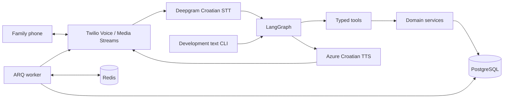

# Zvonko — Family Call Agent

A private, Croatian-speaking family assistant built around ordinary phone calls.
Family members call one number, ask for a reminder, and confirm what Zvonko understood.
The aim is simple: no smartphone app, menus, or new technology for the family to learn.

Zvonko runs on a cloud server, so family members do not need to keep a computer on.
It is a modular monolith: transports share domain services and LangGraph.

> If Mom needs an explanation to use a feature, that feature is not finished.

## Development status — September 6, 2026

**Working pilot, not a finished production service.** Live testing on Hetzner with
PostgreSQL, Redis, Caddy, Twilio, Deepgram and Azure has demonstrated outbound calls,
spoken reminders, an exact two-minute callback after a snooze request, and an inbound
request followed by a scheduled callback. Short spoken confirmations are still unreliable.
Local tests do not establish real-world speech accuracy or delivery guarantees.

Language understanding defaults to **deterministic Croatian rules**. An optional OpenAI
text interpretation layer is now available; see [OPENAI.md](OPENAI.md) for activation,
costs and limitations. It has been tested with mocked responses, not a live API key.
Some domain operations exist as tools but are not yet supported in natural conversation.
The first audio bridge is **half duplex**: wait for Zvonko to finish before replying.
Speech during playback is suppressed to avoid interpreting the assistant's own speech
as confirmation. Barge-in and improved turn boundaries remain on the roadmap.

The family template contains Mom, Dad, Branko and Nataša, with optional Sven.
These roles are a pilot template, not a general-purpose setup wizard. A Windows setup
wizard is planned; the always-on assistant will still need hosting.

Automatic calls are disabled by default. Set `TWILIO_OUTBOUND_ENABLED=true` only after
reviewing pending work and testing the deployment.

## Important limitations

- Medication records reflect what a person reports, not physical verification.
- Zvonko does not provide medical advice or determine, double, or skip doses.
- It cannot detect whether a stove or other appliance is actually on or off.
- It does not guarantee prevention of household accidents or emergency response.
- A past appointment is never automatically treated as an attended appointment.
- A caller-ID allowlist is practical access control, not strong identity verification.
- Voicemail counts as an answered call, never medication or safety confirmation.
  Escalation for answered-but-unconfirmed calls is not implemented.

## Architecture



FastAPI validates transports; LangGraph manages dialogue; typed tools validate arguments;
domain services enforce authorization, confirmation, idempotency and medication rules.
Repositories encapsulate SQLAlchemy and the explicit development JSON store.
Provider adapters never simulate successful production calls.

### Main conversation

Identify the caller, classify the intent, extract arguments and family references,
and ask one short question when information is missing. Read operations can run immediately.
Writes require a summary and explicit confirmation. Rejection cancels the pending action;
correction changes the proposal before confirmation. Unclear confirmation retries are bounded.

### Medication and inventory

A due dose prompts a call. An explicit report of taking it decrements inventory once,
then checks the low-stock threshold. Ringing, silence, uncertainty and reports of not
taking a dose do not decrement stock. Each inventory change is auditable; idempotency
prevents double subtraction. A low-stock episode creates one notification to arrange
a doctor's appointment for renewing medication.

### Doctor appointments

Appointments store the patient, provider, time and reminder offsets. Defaults are
1,440 and 120 minutes: 24 hours and two hours before the appointment. Responses are
recorded without inferring attendance. Create, update, cancel and query operations exist
at the domain/tool layer; conversational coverage is still incomplete.

### Household safety and missed calls

Safety reminders require an explicit completion report. A request to call later schedules
another attempt. By default, an unanswered medication or safety call is retried after
two minutes. After two unanswered attempts, escalation goes to Branko, then Nataša if
Branko does not answer. Contact order lives in `important_no_answer_contact_ids`.
Messages report no answer; they do not claim an accident occurred.

General reminders allow two no-answer attempts, five minutes apart. Busy permits one
retry. User-requested snoozes have a bounded attempt count. Defaults are configurable.

## Repository layout

```text
app/
  api/              Health, internal endpoints and signed Twilio webhooks
  agent/            LangGraphs, Croatian prompts, states and typed tools
  domain/           Enums, time parsing, permissions and medication rules
  models/           SQLAlchemy models
  repositories/     SQL unit of work and development JSON storage
  services/         Reminders, inventory, appointments, calls and audit
  scheduler/        SQL outbox, ARQ jobs, recurrence and recovery
  telephony/        Live audio, Twilio signatures and legacy Infobip boundary
  providers/        Replaceable STT, TTS, telephony and language interfaces
  voice/            Voice policy and pipeline abstractions
  db/migrations/    Alembic migrations
evals/              Croatian deterministic evaluation cases and runner
tests/              Unit, graph and integration tests without paid calls
scripts/            Setup, seeding, diagnostics, releases and explicit smoke tests
```

Documentation is in English. Croatian dialogue, language rules and evaluation examples
remain Croatian because they are the product's supported language.

## Local development without Docker

Use Python 3.11 or newer. Deployment uses Python 3.12.

```bash
python -m venv .venv
# Windows: .venv\Scripts\activate
# Linux/macOS: source .venv/bin/activate
python -m pip install -e ".[dev]"
# Copy .env.example to .env using your shell.
alembic upgrade head
python -m scripts.seed_family
python -m app.dev_cli --caller mama
```

Use `DATABASE_URL=sqlite+aiosqlite:///./zvonko-dev.db` and development providers locally.
Other callers include `tata`, `branko`, `nataša`, `sven` after registration, and `unknown`.
Options include `--show-state`, `--simulate-due` and `--data zvonko-sandbox.json` for
an explicit, separate JSON simulation. `--reset` is allowed only with `--data`.
With development language settings the CLI does not contact paid providers. Selecting
OpenAI enables billable text interpretation in the SQL-backed CLI as well as live calls.

Import existing development JSON into an **empty** migrated SQL database with
`python -m scripts.import_development_data zvonko-dev.json`. Import preserves the original
file and refuses to overwrite records. Seeding also preserves existing family members.
Production requires all four family numbers in E.164 format. Optional `SVEN_PHONE_E164`
adds Sven on a later seed without replacing numbers or reactivating an inactive member.

## Docker Compose

```bash
docker compose up --build -d postgres redis
docker compose run --rm api alembic upgrade head
docker compose run --rm api python -m scripts.seed_family
docker compose up --build api worker
```

The API listens on port 8000, with `/health` and `/docs`. Within Docker use service
hostnames `postgres` and `redis`; local development uses localhost/SQLite instead.

## Configuration

Copy the sanitized `.env.example`; put real values only in your private `.env`.
Never commit filled environment files, database exports, recordings or credentials.

Key settings:

- `DATABASE_URL`, `REDIS_URL`, `APP_SECRET_KEY`, `DEFAULT_TIMEZONE`
- `MAMA_PHONE_E164`, `TATA_PHONE_E164`, `BRANKO_PHONE_E164`, `NATASA_PHONE_E164`, optional `SVEN_PHONE_E164`
- `TELEPHONY_PROVIDER`, `STT_PROVIDER`, `TTS_PROVIDER`, `LLM_PROVIDER`, `LLM_MODEL`
- `TWILIO_ACCOUNT_SID`, `TWILIO_AUTH_TOKEN`, `TWILIO_FROM_NUMBER`, `TWILIO_OUTBOUND_ENABLED`
- Optional `TWILIO_OUTBOUND_CALLER_ID`: a separate, already verified outbound identity
- `PUBLIC_BASE_URL`: your public HTTPS origin, with no path
- `DEEPGRAM_API_KEY`, `AZURE_SPEECH_KEY`, `AZURE_SPEECH_REGION`
- `AZURE_SPEECH_VOICE`, `AZURE_SPEECH_RATE_PERCENT`, `VOICE_MAX_SECONDS`
- Retry, escalation, catch-up and low-stock settings in `app/config.py`

Server-generated `APP_SECRET_KEY` and `POSTGRES_PASSWORD` must survive upgrades.
Do not replace the server's `.env` with a stale local copy.

## Database, migrations and scheduler

```bash
alembic upgrade head
alembic current
python -m scripts.seed_family
uvicorn app.main:app --reload
arq app.scheduler.worker.WorkerSettings
```

SQL stores aware UTC timestamps; dialogue uses `Europe/Zagreb`, including DST.
PostgreSQL is authoritative; Redis is a disposable queue and coordination store.
A transaction serializes one family's changes, including audit and idempotency records.
This is a single-family architecture, not a multi-tenant design. Transactions do not
remain open while waiting for speech or external call requests.

Pending confirmations live in memory for one connection. Disconnecting discards unconfirmed
actions; committed reminders persist. Transports use the shared `conversation_turn` service.

Every five seconds, the worker materializes calls up to 60 minutes ahead and reconstructs
Redis jobs after interruption. It supports one-off, daily and weekly reminders, medication
doses, appointment offsets and notifications. `dispatch_outbound_call` takes a call ID,
never a reminder or plan ID. See [ARQ deferred jobs](https://arq-docs.helpmanual.io/).

A call is claimed as `dialing` before the provider request. API acceptance is not delivery.
Twilio callbacks update associated records; general reminder playback is acknowledged by
a returned audio mark. Medication and safety require a user report. Cancellation and
source changes are checked before dialing; provider cancellation of active calls is not implemented.

After downtime, recurring reminders do not replay the whole backlog. Automatic medication
reminders have a default 30-minute catch-up window: a scheduling limit, not dosing advice.
Explicit snoozes use their newly requested time.

Ambiguous submission timeouts and stale in-flight calls become `delivery_unknown`, without
blind redialing. Confirmed pre-submission failures become `failed`. Review these through
authenticated `/internal/scheduler-status` and provider records. Internal call-status and
call-response endpoints require a bearer secret; they are not public Twilio webhooks.

## Twilio + Deepgram + Azure on Hetzner

The live transport uses Twilio Calls and bidirectional Media Streams, direct Deepgram
Nova-3 (`language=hr`, 8 kHz mu-law), and Azure `hr-HR-SreckoNeural` at -10% rate.
Deepgram model-improvement opt-out is enabled; check its applicable rate. Azure generates
responses on demand. Audio stays in memory; this app does not record live calls.

1. Run `python -m scripts.build_release` locally. Upload `dist/zvonko-release.zip` to
   `/opt/zvonko` and extract with `python3 -m zipfile -e zvonko-release.zip .`.
   The archive excludes environment files, databases and audio.
2. Retain existing server secrets and configure:

   ```dotenv
   TELEPHONY_PROVIDER=twilio
   STT_PROVIDER=deepgram
   TTS_PROVIDER=azure
   LLM_PROVIDER=development
   LLM_MODEL=deterministic-hr
   TWILIO_OUTBOUND_ENABLED=false
   PUBLIC_BASE_URL=https://voice.example.com
   ```

3. Fill credentials and the exact Azure resource region. Sweden Central is **`swedencentral`**.
4. Run `docker compose -f compose.hetzner.yml up -d --build` and verify `/health`.
   Host Caddy proxies the domain to `127.0.0.1:8000`, including WebSocket upgrades.
   PostgreSQL and Redis should not be publicly exposed.
5. Inside the API container, `python -m scripts.test_twilio` checks local configuration
   and registered Branko. `python -m scripts.check_voice` checks Redis and speech services
   without a call, consuming a small amount of speech-provider quota.
6. Set the Twilio number's **A call comes in** webhook to **HTTP POST**
   `https://voice.example.com/twilio/inbound`. Only active registered callers are accepted.
   Outbound URLs and status callbacks are supplied automatically.
7. Only for a deliberate billable test, run `python -m scripts.test_twilio --call` inside
   the API container. It calls registered Branko once. The same key never redials;
   `--key another-test` intentionally permits another test.
8. Review pending work, then set `TWILIO_OUTBOUND_ENABLED=true` and recreate API/worker.
   When false, reminders may be saved but automatic calls and snoozes do not dial.

Signatures use the configured public origin, not untrusted forwarded hosts. Signed stream
tickets expire after 90 seconds and are claimed once in Redis. Calls default to at most
10 minutes, bounded turns and an idle timeout. A completed call never proves medication
was taken or a safety task finished.

Protocol references: [Twilio Calls](https://www.twilio.com/docs/voice/api/call-resource),
[Media Streams](https://www.twilio.com/docs/voice/media-streams/websocket-messages),
[signatures](https://www.twilio.com/docs/usage/security), and
[Deepgram live audio](https://developers.deepgram.com/reference/speech-to-text/listen-streaming).

## Call costs and verified caller ID

There are two separate bills: the family's carrier charges for calling Zvonko's number,
and Twilio/provider charges for running the assistant. Calling a US number from Croatia
may be expensive on the caller's plan. Changing outbound caller ID does **not** change
that inbound destination or the caller's carrier bill.

Twilio supports an [owned, verified caller ID](https://www.twilio.com/docs/voice/api/outgoing-caller-ids)
for outbound calls. Keep `TWILIO_FROM_NUMBER` as the purchased inbound number and set
`TWILIO_OUTBOUND_CALLER_ID` only after verifying the separate number. Leave it blank to
use the purchased number for both directions. Outbound webhook sender checks use this
identity; inbound routing still uses the purchased number.

Verification does not port the number or route incoming calls to Zvonko. Returning a call
to a verified personal number still reaches its original phone service. For affordable
ordinary-phone access, investigate a local voice number or local SIP/BYOC carrier.
Neither is provisioned automatically by this project.

[Twilio Croatia pricing](https://www.twilio.com/en-us/voice/pricing/hr), checked September 6,
2026, lists mobile rates of $0.0950/min from EEA and $0.9045/min otherwise; fixed-line
rates are $0.0300 and $0.2759/min respectively. Speech, Media Streams, rental and applicable
taxes are additional. Check the exact account/destination/origin rate before a paid test:
`python -m scripts.check_call_prices` uses a read-only API and does not dial. It does not
estimate mobile-plan charges or guarantee caller-ID delivery.

Use the local text CLI and mocked audio tests during development. A browser/SIP development
client could avoid international test calls but is not implemented; family members are
still intended to use ordinary phones.

## Azure voice setup

Create an Azure Speech resource and copy a key and its exact region from **Keys and
Endpoint** into private settings. `python -m scripts.setup_azure` opens the existing local
setup helper. It updates Azure settings and `TTS_PROVIDER` in the local `.env`; it does
not change the Azure plan. The key remains plaintext in that private file.

Its preview sends a short non-personal sentence, consumes TTS quota, and saves
`zvonko-azure-preview.wav` for local playback without making a phone call. Select any
available free tier in the Azure portal; entering a key does not select a plan.
Synthesis is not automatically retried.
[Azure TTS REST reference](https://learn.microsoft.com/en-us/azure/ai-services/speech-service/rest-text-to-speech).

## Legacy Infobip transport

`python -m scripts.setup_infobip` prints the legacy checklist. The old adapter uses
`POST /tts/3/single` with Croatian TTS or `audioFileUrl`. Its internal smoke endpoint
requires a bearer secret. It does not connect Twilio outcomes and is not the current
deployment path. Development telephony never dials real numbers.

## Language-provider architecture

Language, STT, TTS and telephony interfaces are replaceable. The optional OpenAI layer
returns structured Croatian paraphrases for the existing parser. It cannot invoke tools,
directly mutate inventory, or bypass authorization and confirmation. Calls to the model
run outside SQL transactions, after checking the caller. Adding an LLM does not fix audio
the recognizer never delivers. Medication and safety outcome classification remains deterministic.

## Tests and evaluations

```bash
ruff check app scripts tests evals
mypy app evals
pytest
python -m evals.runner
```

The deterministic suite reports counts, intent, tool, arguments, latency and failures.
Tests use migrated SQLite and mocked transports, with no billable calls. Real recognition,
latency and caller-ID delivery still require controlled live verification.
See [ROADMAP.md](ROADMAP.md) for outstanding work.

## Privacy and retention

The app does not normally retain raw audio or complete call recordings. It stores structured
reminders, reported medication outcomes, appointments and audit. Provider payloads and
authorization headers do not enter audit. Normal logs redact phone numbers and secrets;
confirmation diagnostics record classifications, not speech.

The proposed policy is to retain active family data until deletion and minimal audit
for 90 days. Automated retention and production backup/deletion procedures remain outstanding;
this is not an implemented purge guarantee. Review provider-side retention separately.

Unknown and inactive callers receive no family records or status. Registered members may
act for family members, with changes attributed in audit.

## Troubleshooting

- **Unknown caller:** check E.164 settings; seeding preserves existing records.
- **Ambiguous time:** give an exact time; vague periods need clarification.
- **Immediate hangup:** inspect API logs, then run `scripts.check_voice` without another call.
- **Azure connection failure:** check region spelling, DNS and container HTTPS access.
- **No callback:** check the outbound flag, worker health and pending SQL records.
- **Unclear confirmation:** let playback finish; recognition remains a pilot limitation.
- **High cost:** distinguish the mobile carrier bill from Twilio usage before changing caller ID.
